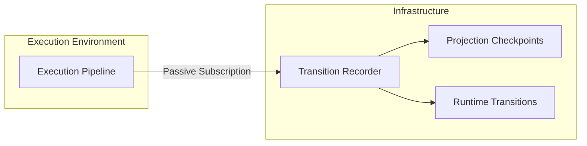

# Runtime Topology

> **Parent:** [Frontend Architecture](ARCHITECTURE.md)
> **Last Updated:** May 2026

This document defines the absolute, unbreachable topological boundaries of the Abren ERP UI runtime architecture. To ensure consistency, determinism, and exact replayability, data MUST flow sequentially through these layers.

---

## 1. The Execution Pipeline

The frontend is a **pure derivation engine**. It transforms user intent and declarative definitions into deterministic output.

```mermaid
graph TD
    subgraph "1. User Interaction"
        UI_I[User Intent]
        CR[Command Runtime]
    end

    subgraph "2. Static Authority (Contracts)"
        D[Definitions]
        D_W[WorkspaceDefinition]
        D_S[ScreenDefinition]
    end

    subgraph "3. Projection Resolution Pipeline"
        R[Resolvers]
        Sem[Semantic Resolution]
        Cap[Capability Resolution]
        Proj[Projection Emission]

        R --> Sem
        Sem --> Cap
        Cap --> Proj
    end

    subgraph "4. Presentation Boundary"
        Ren[Rendering Runtime]
        Pres[Presentation Layer]
    end

    %% Flow
    UI_I --> CR
    CR -- Mutation --> R
    D --> R

    Proj --> Ren
    Ren --> Pres

    style "2. Static Authority (Contracts)" fill:#1a472a,stroke:#2d6a4f,color:#fff
    style "3. Projection Resolution Pipeline" fill:#1b3a4b,stroke:#3d5a80,color:#fff
    style "4. Presentation Boundary" fill:#2d3a3a,stroke:#556b6b,color:#fff
```

### Layer Constraints

1.  **Definitions**: Purely declarative. Cannot import Vue, cannot have state.
2.  **Command Runtime**: Orchestrates mutations. Must result in a discrete state change that triggers Resolver re-evaluation.
3.  **Projection Resolution Pipeline**: The deterministic state + meaning layer.
    - **CONTRACT**: Payloads MUST be JSON-serializable (no classes, closures, or refs).
    - **IMMUTABILITY**: Projections are point-in-time snapshots of the _entire_ world (state + semantics + capabilities).
    - **SEMANTIC AUTHORITY**: Projections are "Born Semantic." Canonical meaning (precision, formatting, visibility) is resolved _during_ projection, not rendering.
    - **PURITY**: Resolvers MUST NOT mutate external state or registries.
4.  **Rendering Runtime**: The DI boundary mapping abstract `rendererKey` strings to Vue components.
5.  **Presentation Layer**:
    - **ROLE**: May manage ephemeral UI state (hover, focus, local toggle), but MUST NOT perform business, semantic, workflow, or policy resolution.

---

## 2. The Deterministic Transition Recorder

The `TransitionRecorder` sits **outside** the execution pipeline as a passive oscilloscope.



---

## 3. Determinism Rules

1.  **Timestamp Non-Authority**: Runtime timestamps (performance.now, Date.now) are **observational metadata only**. They MUST NOT participate in projection resolution, policy evaluation, or state transition logic.
2.  **Sequential Revision**: Every projection lineage MUST have a monotonically increasing `projectionRevision`.
3.  **Patch Totality**: Transitions MUST represent the total delta from the previous state via formal patch operations (`replace`, `remove`, `append`, `move`, `insert`, `truncate`).
4.  **Projection Symmetry**: All state exposed to the rendering runtime MUST be derived from the projection.
