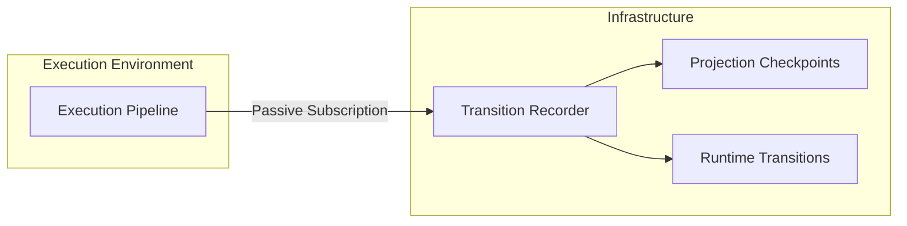

# Runtime Topology

> **Parent:** [Frontend Architecture](ARCHITECTURE.md)
> **Last Updated:** May 2026

This document defines the absolute, unbreachable topological boundaries of the Abren ERP UI runtime architecture. To ensure consistency, determinism, and exact replayability, data MUST flow sequentially through these layers. Skipping layers or creating bi-directional references fundamentally breaks the determinism model and will be caught by static analysis.

---

## 1. The Execution Pipeline

The frontend acts as a pure derivation engine. It transforms declarative definitions and dynamic state into a deterministic output.

```mermaid
graph TD
    subgraph "1. Static Authority (Contracts)"
        D[Definitions]
        D_W[WorkspaceDefinition]
        D_S[ScreenDefinition]
        D_Sem[SemanticContract]
    end

    subgraph "2. Pure Resolution Engine"
        R[Resolvers]
        R_W[resolveWorkspaceModel]
        R_S[resolveScreenModel]
    end

    subgraph "3. Deterministic State (State A & B)"
        P[Projection Runtime]
        P_W[WorkspaceModel]
        P_S[ScreenModel]
    end

    subgraph "4. Canonical Meaning (State C)"
        Sem[Semantic Runtime]
        Sem_R[Semantic Instructions]
    end

    subgraph "5. Presentation Boundary"
        Ren[Rendering Runtime]
        Pres[Presentation Layer (Vue)]
    end

    %% Flow
    D_W --> R_W
    D_S --> R_S

    R_W --> P_W
    R_S --> P_S

    P_S --> Sem
    D_Sem --> Sem

    Sem --> Sem_R

    P_W --> Ren
    Sem_R --> Ren

    Ren --> Pres

    style "1. Static Authority (Contracts)" fill:#1a472a,stroke:#2d6a4f,color:#fff
    style "3. Deterministic State (State A & B)" fill:#1b3a4b,stroke:#3d5a80,color:#fff
    style "4. Canonical Meaning (State C)" fill:#3d2b1f,stroke:#6b4226,color:#fff
    style "5. Presentation Boundary" fill:#2d3a3a,stroke:#556b6b,color:#fff
```

### Layer Constraints

1. **Definitions**: Purely declarative. Cannot import Vue, cannot have state.
2. **Resolvers**: Pure synchronous functions. Cannot perform network requests, cannot use `setTimeout`, cannot use Vue reactivity directly.
3. **Projection Runtime**: The immutable `ProjectionEnvelope<T>`. Contains no formatting or rendering dependencies.
4. **Semantic Runtime**: Adds canonical instructions (`rawValue`, `formatterKey`, `displayPolicy`). Cannot import Vue `Component`.
5. **Rendering Runtime**: The dependency injection boundary mapping abstract `rendererKey` strings to actual Vue implementations.
6. **Presentation Layer**: Dumb Vue components. Only capable of interpreting projections, not making semantic or business decisions.

---

## 2. The Deterministic Transition Recorder

The `TransitionRecorder` sits **outside** the execution pipeline as a passive oscilloscope.



- **Passive Subscriber**: The execution pipeline does NOT depend on the Transition Recorder.
- **Immutable Timeline**: The Transition Recorder records discrete `RuntimeTransition`s (patches) and occasional `ProjectionCheckpoint`s. It never maintains global state like "active screen".

---

## 3. Determinism Rules

1. **Timestamp Non-Authority**: Runtime timestamps (performance.now, Date.now) are **observational metadata only**. They MUST NOT participate in projection resolution, policy evaluation, or state transition logic.
2. **Sequential Revision**: Every projection lineage MUST have a monotonically increasing `projectionRevision`.
3. **Patch Totality**: Transitions MUST represent the total delta from the previous state via formal patch operations.
